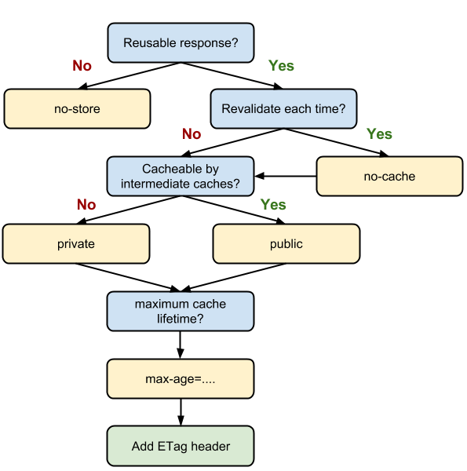

Mục tiêu: tăng tốc độ trang web, bằng cách giảm thiểu số lượng request từ browser đến server thông qua việc cache resource html, js, css, image... (từ giờ đến cuối bài viết gọi chung là resource) tại browser bằng Header.

Các Header cần chú ý:  Combo **ETag** + **If-None-Match** và **Cache-Control**

### ETag và If-None-Match
Cách thức hoạt động thường gặp: 

1) Browser muốn tải file js tại địa chỉ example.com/test.js

2) Server trả về file test.js, kèm theo Header **ETag** có nội dung *x234dff* . 

3) Browser tải file test.js về và sử dụng.

4) Browser muốn tải lại test.js ở 1 màn hình khác, phát hiện bản test.js được cache đã hết hạn (bằng cách đọc **Cache-Control** của file, sẽ giải thích ở dưới).

5) Browser tải file từ example.com/test.js và gửi kèm Header **If-None-Match** với nội dung *x234dff* .

5a) Server đọc **If-None-Match** và lấy được value *x234dff*  và thấy rằng file test.js không có thay đổi gì, gửi lại response với Header status code 304 Not Modified, **ETag** *x234dff*, thay vì gửi lại toàn bộ file test.js.

5b) Server đọc **If-None-Match** và lấy được value *x234dff*  và thấy rằng file test.js đã thay đổi, server tính toán để có token mới và gửi lại browser file test.js mới kèm theo token mới trong **ETag**

6) Quay lại bước 2.

TL,DR: hãy đảm bảo server trả lại ETag, mọi việc còn lại browser sẽ tự lo. Tham khảo về cách config các server phổ biến để gửi về **ETag** tại [đây](https://github.com/h5bp/server-configs)

### Cache-Control
Mục đích: điều khiển caching policy cho mỗi resource của browser.

Các thuộc tính hay dùng 
* max-age
Ví dụ `Cache-Control: max-age: 60` báo với browser rằng resource này có thể được dùng trong tối đa 60 giây tiếp theo mà ko cần kiếm tra lại với server. Từ giây 61 trở đi resource sẽ hết hạn, browser sẽ cần liên hệ với server để kiểm tra/tải file mới về.

* no-store
Như tên gọi, không lưu ở trong cache của browser, luôn luôn tải file mới nhất về.

* no-cache
Luôn luôn check với browser trước khi dùng lại resource ở cache. Nên kết hợp với  **ETag**  để tránh download tại toàn bộ resource.
* must-revalidate 
Tương tự no-cache nhưng thay vì luôn check với browser, mặc định dùng resource tại cache trước cho đến khi max-age hết hạn
* private
Resource có thể được cache tại browser cache nhưng không thể cache tại những chỗ công cộng khác như CDN hoặc cache của ISP.

Use case

* Resource nhạy cảm, thay đổi nhiều và không nên cache (ví dụ trang html của website i-banking): `Cache-Control: no-store`
* Resource thay đổi nhiều (ví dụ trang html của 1 single page application): `Cache-Control: no-cache, private, max-age=86400` + `ETag`
* Resource không bao giờ thay đổi (ví dụ file js, css đã có finger print):  `Cache-Control: public, max-age: 31536000`

### Nghiên cứu về caching policy của một số trang web phổ biến
(còn tiếp)

### References
* https://csswizardry.com/2019/03/cache-control-for-civilians/
* https://developers.google.com/web/fundamentals/performance/optimizing-content-efficiency/http-caching
* https://developer.mozilla.org/en-US/docs/Web/HTTP/Headers/Cache-Control