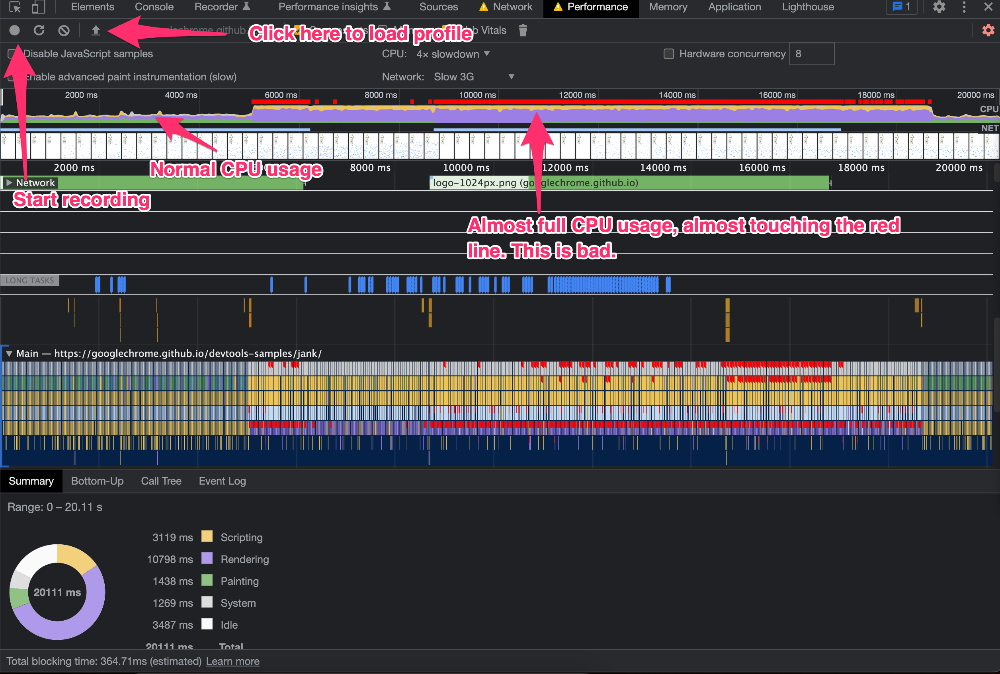
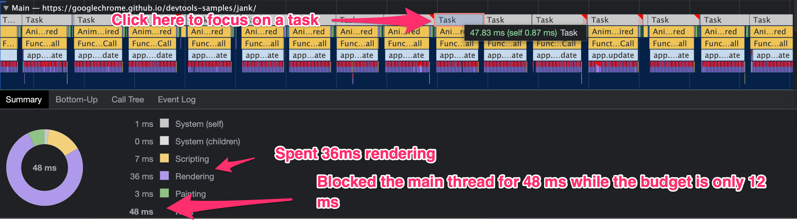

Gần đây có một số bạn nhắn tin hỏi mình cách đo runtime performance bằng Chrome DevTools, thấy trên mạng cũng có nhiều bài hướng dẫn nhưng đa số là đã outdated và viết cho các phiên bản Chrome cũ, nay mình sẽ viết một bài mới dùng Chrome bản mới nhất (108.0.5359.124). Lưu ý là bạn nên hiểu qua về cách browser hoạt động và render thì mới thấy bài viết này có tác dụng được, có thể đọc [bài viết này](https://web.dev/rendering-performance/) để biết thêm chi tiết. Ok chúng ta bắt đầu.

Việc đầu tiên là mở Incognito mode, mở Devtools, ấn vào tab Performance, ở ví dụ này chúng ta sẽ dùng https://googlechrome.github.io/devtools-samples/jank/ làm ví dụ (hoặc các bạn có thể tải file example01.json đính kèm), sau đó ấn vào nút tròn để bắt đầu Record, sau đó quay lại trang web và thực hiện vài thao tác bạn đang nghi ngờ có performance kém, xong xuôi thì ấn stop, sẽ thấy màn hình kết quả như dưới:



Thoạt nhìn sẽ thấy rất choáng ngợp vì quá nhiều thông tin được hiển thị, không sao, chúng ta sẽ chỉ quan tâm đến phần nào dễ thôi :yaomin:. Như đã đánh dấu trên hình, khung đầu tiên hiển thị performance của CPU bằng area chart, màu vàng là scripting (JS), màu tím là rendering (Style, Layout), màu xanh là painting (Paint, Composite). Nhìn qua ảnh ở trên thì các bạn có thể thấy ngay phần lớn cái area chart là màu tím, vậy suy ra phần đang ảnh có ảnh hưởng nhất là rendering (Style, Layout).

Ngoài ra, các bạn cũng cần để ý đường màu đỏ, đó là những lúc FPS drop khá nhiều và sẽ ảnh hưởng đến UX.

Ok, tiếp theo Zoom kĩ hơn vào phần Main ở dưới để xem browser đã thực sự làm gì, chỗ này mình hơi lười viết nhưng chắc nhìn ảnh các bạn cũng hiểu:



Bước tiếp theo thì đơn giản thôi, click vào 1 trong 3 cái menu ở bên cạnh và mò từng dòng một thôi, ở ví dụ này thì chúng ta đã tìm ra thủ phạm khá đơn giản, dĩ nhiên trong thực tế thì các bạn sẽ phải mò khá nhiều qua tầng tầng lớp lớp call stack của các framework:


Ok vậy là các bạn đã có thể nắm sơ qua về phần CPU và Main thread cũng như phần Summary của tab Performance, mình sẽ đưa nốt một ví dụ để các bạn hiểu về phần Frame, lần này chúng ta sẽ dùng http://output.jsbin.com/woyoce/1/quiet hoặc các bạn có thể tải file [example02.json](./media/29/example02.json) lên rồi làm theo. Đến đây thì các bạn sẽ tự hỏi tại sao phần CPU ở đây trong lại khác thế, câu trả lời là ... mình cũng không biết, but anyway, nếu zoom in vào phần màu đỏ, sẽ thấy được rất nhiều frame bị drop, dẫn đến tình trạng giật lag:


Áp dụng kiến thức vừa học, zoom vào main thread, click vào 1 Task:


sau đó vào Call Tree mò, sẽ tìm ra thủ phạm, là dòng code sau đây:

```js
for (var b = 0; b < boxes.length; b++) {
  boxes[b].style.webkitTransform = makeTransform(b);
}
```


Ngoài ra thì DevTools còn rất nhiều tính năng khác như là đo memory, fps meter, xem composite layer, các bạn có thể tìm hiểu thêm ở [course này](https://www.udacity.com/course/browser-rendering-optimization--ud860).